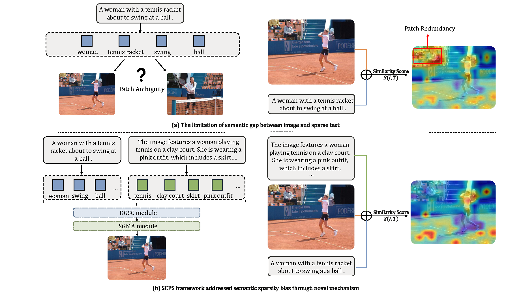
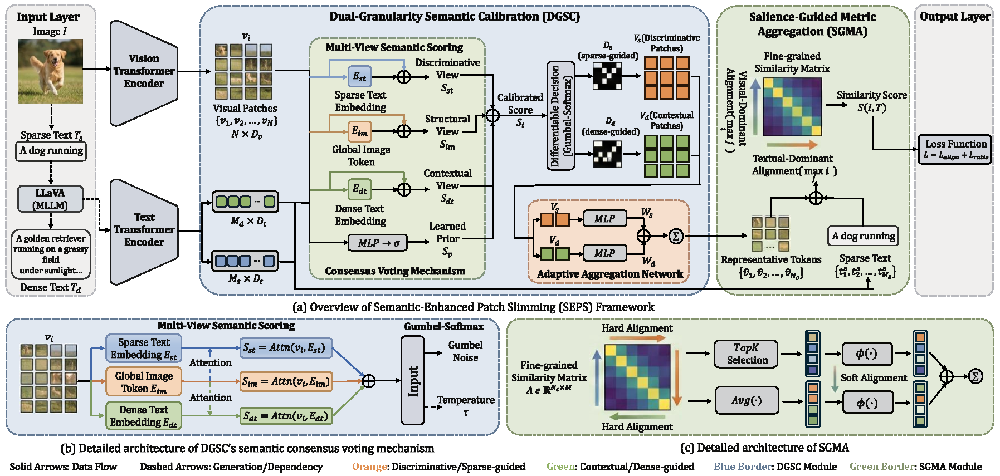

<div align="center">

# SEPS: Semantic-Enhanced Patch Slimming Framework for Fine-Grained Cross-Modal Alignment

<p>
  <a href="https://arxiv.org/abs/2511.01390"></a>
  
  
  
</p>

<p>
  <b>Official PyTorch implementation of our ICML 2026 paper</b><br>
  <i>Semantic-enhanced patch slimming for fine-grained cross-modal alignment.</i>
</p>

<p>
  <a href="https://arxiv.org/abs/2511.01390">Paper</a> ·
  <a href="#introduction">Introduction</a> ·
  <a href="#training">Training</a> ·
  <a href="#evaluation">Evaluation</a> ·
  <a href="#performances">Results</a> ·
  <a href="#citation">Citation</a>
</p>

</div>

> [!IMPORTANT]
> 🎉 **Our paper has been accepted to ICML 2026!**  
> **SEPS** addresses semantic sparsity bias in fine-grained image-text retrieval by combining sparse captions with MLLM-generated dense semantics for more reliable patch selection and cross-modal matching.

## 🔥 News

- **[2026-06]** SEPS was accepted to **ICML 2026**. Thanks to the reviewers and area chairs for their valuable feedback!
- **[2026-06]** We release the official code, training scripts, evaluation scripts, reproduced results, checkpoints, and logs.

## ✨ Highlights

- **Semantic Sparsity Bias.** We identify the mismatch between dense visual signals and sparse textual captions as a key bottleneck in fine-grained cross-modal alignment.
- **Dual-Granularity Semantic Calibration.** We use MLLM-generated dense descriptions as holistic visual-linguistic anchors and combine them with sparse captions to guide robust patch slimming.
- **Salience-Guided Metric Aggregation.** We reduce similarity dilution by emphasizing highly relevant patch-word correspondences instead of uniformly averaging all local matches.
- **Strong empirical performance.** SEPS achieves state-of-the-art image-text retrieval results on **Flickr30K** and **MS-COCO** across multiple visual backbones, with particularly strong gains for text-to-image retrieval.

This repository is built upon the excellent implementations of [LAPS](https://github.com/CrossmodalGroup/LAPS) and [D2S-VSE](https://github.com/liuyyy111/d2s-vse).


## Introduction
Fine-grained cross-modal alignment constitutes the bedrock of modern vision-language understanding, serving as the pivotal mechanism for establishing precise correspondences between visual regions and linguistic concepts. This alignment capability underpins a wide spectrum of downstream applications, ranging from visual question answering and image captioning to the increasingly demanding task of cross-modal retrieval. As multimodal systems evolve toward granular comprehension, the ability to accurately disentangle and align complex visual scenes with specific semantic cues has become a critical imperative.

<div align=center>

</div>

Despite significant progress, current alignment paradigms universally encounter a fundamental theoretical bottleneck: \textbf{Semantic Sparsity Bias}. This bias arises from the intrinsic asymmetry between modalities—visual inputs inherently carry dense, continuous, and high-entropy spatial information, whereas textual descriptions (captions) act as sparse, discrete, and low-entropy anchors. In Vision Transformer (ViT) architectures, this asymmetry manifests as two persistent challenges: \textit{patch redundancy}, where a vast majority of visual tokens lack explicit textual supervision, and \textit{patch ambiguity}, where the concise nature of sparse text fails to provide sufficient discriminative cues for specific visual regions. As illustrated in Figure \ref{fig:motivation}(a), a generic caption such as "A woman with a tennis racket" fails to describe the surrounding context or specific visual attributes, leading to the inadvertent suppression of visually vital but textually unmentioned patches during the alignment process.

Recent advancements have sought to leverage Multimodal Large Language Models (MLLMs) to augment textual representations. While promising, naive integration of MLLMs often introduces \textit{semantic drift}, where the hallucinated or overly detailed descriptions from MLLMs conflict with the ground-truth sparse captions, creating noise that degrades retrieval precision. Furthermore, conventional alignment metrics typically rely on global mean pooling, which indiscriminately aggregates scores from all patches. This approach is fundamentally flawed in complex scenes, as irrelevant background patches with low similarity scores effectively dilute the contribution of highly aligned foreground regions, obscuring the true semantic correlation.


To address these limitations, we propose the \textbf{Semantic-Enhanced Patch Slimming (SEPS)} framework, a systematic approach designed to resolve the Semantic Sparsity Bias through a novel Dual-Granularity Semantic Calibration (DGSC) mechanism. As shown in Figure 1(b), our key insight is to treat MLLM-generated content not merely as auxiliary text, but as a Holistic Visual-Linguistic Anchor. By integrating this dense anchor with the original sparse queries, we establish a semantic consensus mechanism that cross-verifies visual patches against both discriminative keywords (Sparse) and contextual narratives (Dense).

Functionally, as depicted in Figure 1(a), SEPS operates through a sophisticated pipeline. We first extract multi-view features and employ the DGSC module to identify salient visual patches. Unlike previous methods that filter patches based on single-source supervision, DGSC performs a ``weighted consensus'' process to preserve patches that are relevant to either the specific query or the global context. Subsequently, we introduce the Salience-Guided Metric Aggregation (SGMA) module, which replaces standard mean pooling with a relevance-aware alignment strategy. This ensures that the final similarity score is dominated by the most semantically significant patch-word pairs, making the metric robust to background noise.

Extensive experiments on Flickr30K and MS-COCO datasets demonstrate that SEPS achieves state-of-the-art performance, outperforming existing methods by 23\%-86\% in rSum across various model backbones, with particularly significant improvements in text-to-image retrieval tasks.

<div align=center>

</div>


## Preparation

### Environments
We recommended the following dependencies:
- python >= 3.8
- torch >= 1.12.0
- torchvision >= 0.13.0
- transformers >=4.32.0
- opencv-python
- tensorboard


### Datasets

We have prepared the caption files for two datasets in  `data/` folder, hence you just need to download the images of the datasets. 
The Flickr30K (f30k) images can be downloaded in [flickr30k-images](https://www.kaggle.com/datasets/hsankesara/flickr-image-dataset). The MSCOCO (coco) images can be downloaded in [train2014](http://images.cocodataset.org/zips/train2014.zip), and [val2014](http://images.cocodataset.org/zips/val2014.zip).
We hope that the final data are organized as follows:


```
data
├── coco  # coco captions
│   ├── coco_testall.jsonl
│   ├── coco_train.jsonl
│   ├── train_ids.txt
│   ├── train_caps.txt
│   ├── testall_ids.txt
│   ├── testall_caps.txt
│   └── id_mapping.json
│
├── f30k  # f30k captions
│   ├── f30k_test.jsonl
│   ├── f30k_train.jsonl
│   ├── train_ids.txt
│   ├── train_caps.txt
│   ├── test_ids.txt
│   ├── test_caps.txt
│   └── id_mapping.json
│
├── flickr30k-images # f30k images
│
├── coco-images # coco images
│   ├── train2014
│   └── val2014
```


### Model Weights

Our framework needs to get the pre-trained weights for [BERT-base](https://huggingface.co/bert-base-uncased), [ViT-base](https://huggingface.co/google/vit-base-patch16-224-in21k), and [Swin-base](https://huggingface.co/microsoft/swin-base-patch4-window7-224) models. 
You also can choose the weights downloaded by [transformers](https://github.com/huggingface/transformers) automatically (the weights will be downloaded at  `~/.cache`).


## Training
First, we set up the **arguments**, detailed information about the arguments is shown in ```arguments.py```.

- `--dataset`: the chosen datasets, e.g., `f30k` and `coco`.
- `--data_path`: the root path of datasets, e.g., `data/`.
- `--multi_gpu`: whether to use the multiple GPUs (DDP) to train the models.
- `--gpu-id`, the chosen GPU number, e.g., 0-7.
- `--logger_name`, the path of logger files, e.g., `runs/f30k_test` or `runs/coco_test`


Then, we run the ```train.py``` for model training. 
The models need about 20,000 GPU-Memory (one 3090 GPU) when batch size = 64 and about 40,000 GPU-Memory (one A40 GPU) when batch size = 108.
You need to modify the batch size according to the hardware conditions, and we also support the **multiple GPUs** training. 
Besides, considering the GPU-memory limitation, we don't integrate the Gumbel-softmax sampling for the patch selection in the repository. 
The performances are not affected much but GPU-memory is reduced a lot (see more details in the paper).

```
## single GPU

### vit + f30k 
python train.py --dataset f30k --gpu-id 0 --logger_name runs/f30k_vit --batch_size 64 --vit_type vit --embed_size 512 --sparse_ratio 0.5 --aggr_ratio 0.4

### swin + f30k
python train.py --dataset f30k --gpu-id 0 --logger_name runs/f30k_swin --batch_size 64 --vit_type swin  --embed_size 512 --sparse_ratio 0.8 --aggr_ratio 0.6

### vit + coco 
python train.py --dataset coco --gpu-id 0 --logger_name runs/coco_vit --batch_size 64 --vit_type vit --embed_size 512 --sparse_ratio 0.5 --aggr_ratio 0.4

### swin + coco
python train.py --dataset coco --gpu-id 0 --logger_name runs/coco_swin --batch_size 64 --vit_type swin  --embed_size 512 --sparse_ratio 0.8 --aggr_ratio 0.6


## multiple GPUs

### vit + f30k
CUDA_VISIBLE_DEVICES=0,1 python -m torch.distributed.run --nproc_per_node=2 train.py --dataset f30k --multi_gpu 1 --logger_name runs/f30k_vit --batch_size 64 --vit_type vit --embed_size 512 --sparse_ratio 0.5 --aggr_ratio 0.4

### swin + f30k
CUDA_VISIBLE_DEVICES=0,1 python -m torch.distributed.run --nproc_per_node=2 train.py --dataset f30k --multi_gpu 1 --logger_name runs/f30k_swin --batch_size 64 --vit_type swin --embed_size 1024 --sparse_ratio 0.8 --aggr_ratio 0.6


### vit + coco
CUDA_VISIBLE_DEVICES=0,1,2,3 python -m torch.distributed.run --nproc_per_node=4 train.py --dataset coco --multi_gpu 1 --logger_name runs/coco_vit --batch_size 64 --vit_type vit --embed_size 512 --sparse_ratio 0.5 --aggr_ratio 0.4

### swin + coco
CUDA_VISIBLE_DEVICES=0,1,2 python -m torch.distributed.run --nproc_per_node=3 train.py --dataset coco --multi_gpu 1 --logger_name runs/coco_swin --batch_size 72 --vit_type swin --embed_size 512 --sparse_ratio 0.8 --aggr_ratio 0.6
CUDA_VISIBLE_DEVICES=0,1,2,3 python -m torch.distributed.run --nproc_per_node=4 train.py --dataset coco --multi_gpu 1 --logger_name runs/coco_swin --batch_size 64 --vit_type swin --embed_size 512 --sparse_ratio 0.8 --aggr_ratio 0.6
```

## Evaluation
Run ```eval.py``` to evaluate the trained models on f30k or coco datasets, and you need to specify the model paths.

```
python eval.py --dataset f30k --data_path data/ --gpu-id 0
python eval.py --dataset coco --data_path data/ --gpu-id 1
```


## Performances
The following tables show the reproducing results of cross-modal retrieval on **MSCOCO** and **Flickr30K** datasets. 
We provide the training logs, checkpoints, performances, and hyper-parameters.

|Datasets| Visual encoders |I2T R@1|I2T R@5|T2I R@1|T2I R@5| rSum | Model checkpoint and train log|
|:---:|:---:|:---:|:---:|:---:|:---:|:---:|:---:|
|Flickr30K |ViT-224 | 86.1 | 93.7  | 86.9 | 98.1 | 560.9 |[Link](https://drive.google.com/drive/folders/1muHqWyKgzyDQ4fqSo5QgRPtXLTJEVdbZ?usp=drive_link)|
|Flickr30K |ViT-384 | 90.7 | 94.4  | 89.3 | 99.3 | 571.5 |[Link](https://drive.google.com/drive/folders/1iUVqFBj1odFvrAjxyF_QNgpw-DDf-Za_?usp=drive_link)|
|Flickr30K |Swin-224 | 89.8 | 96.9 | 88.0 | 98.9 | 572.0 |[Link](https://drive.google.com/drive/folders/1YUZ10szYk5hnvzz8rfCAcV1ai1_bd3wH?usp=drive_link)|
|Flickr30K |Swin-384 | 93.6 | 98.3 | 91.6 | 99.4 | 581.9 |[Link](https://drive.google.com/drive/folders/1_YDDBH2F_HnoBTQGTvogXlrEKaTIFq0G?usp=drive_link)|
|MSCOCO-1K |ViT-224 | 89.0 | 94.8  | 88.5 | 99.3  | 569.5 |[Link](https://drive.google.com/drive/folders/1eRgjDuGYAdnqHB2l3EvVeJmfkS9GhmaV?usp=drive_link)|
|MSCOCO-1K |ViT-384 | 90.9 | 96.1  | 91.0 | 99.5 | 576.1 |[Link](https://drive.google.com/drive/folders/1WuY6cyZBK7ImzFkni3YeLRN_2x7z-2E3?usp=drive_link)|
|MSCOCO-1K |Swin-224 | 87.2 | 94.9 | 84.7 | 99.0 | 563.9 |[Link](https://drive.google.com/drive/folders/1lV6E9D-3IVZMY79acSRbVp66HQSs2gqC?usp=drive_link)|
|MSCOCO-1K |Swin-384 | 89.5 | 96.5 | 87.1 | 99.2 | 571.2 |[Link](https://drive.google.com/drive/folders/1x-szyZmRFPHatwoUk9x-mQU5NWf7SVc3?usp=drive_link)|
|MSCOCO-5K |ViT-224 | 73.9 | 85.2 | 73.5 | 94.5 | 516.9 |[Link](https://drive.google.com/drive/folders/1eRgjDuGYAdnqHB2l3EvVeJmfkS9GhmaV?usp=drive_link)|
|MSCOCO-5K |ViT-384 | 77.8 | 88.7 | 78.5 | 96.3  | 534.6 |[Link](https://drive.google.com/drive/folders/1WuY6cyZBK7ImzFkni3YeLRN_2x7z-2E3?usp=drive_link)|
|MSCOCO-5K |Swin-224 | 71.9 | 86.0  | 66.8 | 92.2 | 506.1 |[Link](https://drive.google.com/drive/folders/1lV6E9D-3IVZMY79acSRbVp66HQSs2gqC?usp=drive_link)|
|MSCOCO-5K |Swin-384 | 74.7 | 88.4  | 70.3 | 93.8 | 519.1 |[Link](https://drive.google.com/drive/folders/1x-szyZmRFPHatwoUk9x-mQU5NWf7SVc3?usp=drive_link)|


## Citation

If you find SEPS useful in your research, please consider citing our paper. The official ICML/PMLR BibTeX will be updated once available.

```bibtex
@misc{mao2026seps,
  title  = {SEPS: Semantic-Enhanced Patch Slimming Framework for Fine-Grained Cross-Modal Alignment},
  author = {Mao, Xinyu and Li, Junsi and Zhang, Haoji and Liang, Yu and Sun, Ming},
  year   = {2026},
  note   = {Accepted to ICML 2026},
  url    = {https://arxiv.org/abs/2511.01390}
}
```

